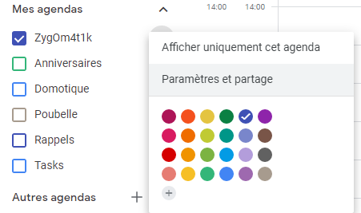
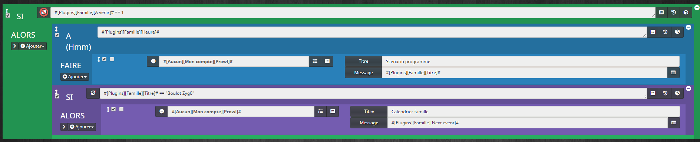

Description 
===

Ce plugin permet récupérer des calendrier distants(Apple,google,Nextcloud,Caldav..) ou locaux. Possibilité d'interagir et de lancer des actions selon l'évènement.

# 📜 CONTRAT FONCTIONNEL — GESTION DES ÉVÉNEMENTS ICS
_Version finale_

---

## 🎯 Objectif
Définir un comportement **prévisible**, **idempotent** et **robuste** pour la gestion d’événements ICS, incluant :
- événements horaires
- événements *all-day*
- événements multi-jours
- changements d’heure (DST)
- modifications du fichier ICS

---

## 📅 Types d’événements

### Événement horaire
- Défini par une date **et une heure**
- Déclenchement basé sur `DTSTART` (heure locale)

### Événement *all-day*
- Défini par une **date uniquement**
- Aucune heure native
- Déclenchement à une **heure locale configurable**
- Calculs basés sur des **dates**, jamais des timestamps

---

## ⏰ Heure de déclenchement (*all-day*)
- Option configurable (`allDayTriggerTime`)
- Utilisée uniquement pour déclencher l’action
- Ne modifie pas l’événement ICS
- Doit être hors plages DST à risque (02:00–03:00)

---

## 📆 États fonctionnels

Un événement ne peut être que dans **un seul état** à la fois :

| État | Rôle |
|-----|------|
| **INACTIVE** | Hors période |
| **TOMORROW** | Information / anticipation |
| **TODAY** | Autorisation de déclenchement |
| **ACTIVE** | Action déjà exécutée |

---

## 🔔 Règles de déclenchement

### Actions métier
- Autorisées **uniquement** si :
  - état = `TODAY`
  - heure atteinte (si applicable)
  - action non encore exécutée pour cette date

### Actions d’information
- Autorisées sur `TOMORROW`
- Ne déclenchent aucune action métier

---

## 📆 Événements multi-jours

- `TODAY` peut durer plusieurs jours
- Action métier :
  - déclenchée **une seule fois**, le premier jour
- Les jours suivants :
  - information / affichage uniquement
- `TOGO` calculé jusqu’au **premier jour**

---

## 🧠 Mémoire / idempotence

Pour chaque événement :
- mémorisation de la **date du dernier déclenchement**
- basée sur **UID + date**
- aucune dépendance au nombre d’exécutions du cron

---

## 🕒 Règles DST (changement d’heure)

- DST n’affecte **jamais** :
  - les états
  - les dates
  - `TOGO`
- All-day totalement indépendant du DST
- Événement horaire :
  - déclenchement uniquement sur une heure **valide et atteignable**
- Aucun rattrapage automatique

---

## ✏️ Édition / suppression ICS

- Les états sont **recalculés dynamiquement**
- Une action déjà exécutée :
  - n’est jamais annulée
- Si la date de début change :
  - une nouvelle action peut être autorisée
- Suppression d’un événement :
  - aucun déclenchement
  - aucun rollback

---

## 🚫 Règles interdites

- ❌ Action métier sur `TOMORROW`
- ❌ Calcul all-day en timestamps
- ❌ Déclenchement multiple pour une même date
- ❌ Compensation automatique DST
- ❌ Annulation d’actions déjà exécutées

---

## 🧠 Règle d’or
> **Les états sont recalculés.  
> Les actions sont mémorisées.**

---

# 🧪 TABLE DES CAS LIMITES
_Multi-day · DST · Édition ICS_

| # | Situation | Comportement attendu |
|---|----------|---------------------|
| 1 | All-day aujourd’hui | TODAY, action possible à l’heure configurée |
| 2 | All-day demain | TOMORROW, info uniquement |
| 3 | All-day multi-jours (3 jours) | TODAY sur 3 jours, action **une seule fois** |
| 4 | Multi-day déplacé d’1 jour | États recalculés, action possible sur nouvelle date |
| 5 | Multi-day étendu | Aucun nouveau déclenchement |
| 6 | Événement horaire à 02:30 (heure d’été) | Heure inexistante → aucun déclenchement |
| 7 | Événement horaire à 02:30 (heure d’hiver) | Une seule action (pas de doublon) |
| 8 | Cron exécuté 2× à la même heure (DST) | Une seule action (idempotence) |
| 9 | All-day avec trigger à 07:00 le jour DST | Déclenchement normal |
|10 | ICS édité : date future → aujourd’hui | TODAY → action possible |
|11 | ICS édité : aujourd’hui → passé | INACTIVE, aucune action |
|12 | ICS édité : horaire ↔ all-day | Règles du nouveau type appliquées |
|13 | ICS supprimé | INACTIVE, aucun déclenchement |
|14 | Reboot serveur avant déclenchement | Action déclenchée au prochain cron valide |
|15 | Reboot après déclenchement | Aucune répétition |
|16 | Changement fuseau serveur | États basés sur date locale |

Configuration du plugin
===

Après le téléchargement du plugin, il vous suffit de l'activer et de le configurer.

> **IMPORTANT**

>  CE PLUGIN NE PERMET PAS DE MODIFIER OU EDITER UN CALENDRIER DISTANT

>En mode *Debug* le plugin est très verbeux, il est recommandé d'utiliser ce mode seulement si vous devez diagnostiquer un problème particulier.
Il n’est pas recommandé de laisser tourner le plugin en *Debug* en permanence, si on utilise une *SD-Card*.
Une fois le debug terminé, il ne faut pas oublier de retourner sur un niveau moins élevé comme le niveau *Error* qui ne remonte que d'éventuelles erreurs.

> **NOTE**

>Le plugin permet de :
-Récupérer un calendrier via url (Apple, google,Nextcloud,synology,Caldav)  et d'interagir en créant des événements 
-Récupérer un calendrier ics en local et l'intégrer à jeedom
-De créer des événements liés à un calendrier avec le même nom et de créer des actions au début ou à la fin de l'événement. Donc en créant un événement sur votre calendrier ios ou google cela va pouvoir lancer des actions dans Jeedom
-D'intégrer la Timeline officielle dans un calendrier.
-D'avoir un widget sur le dashboard paramétrable.

**?title?** : retourne le titre de l'événement

**?hour?** : retourne l'heure de début de l'événement 

Il faut configurer les champs pour le retour des informations avec les commandes "today" et "tomorrow" d'un calendrier. (Commande à utiliser ensuite via TTS , notification...). Mettre ?title? pour le titre de l'événement et ?hour? pour l'heure .

Une fois activer aller dans plugins/organisation/ Calendrier Ics

Cliquer sur le "+"

Vous pourrez alors ajouter un calendrier, un événement,la timeline ou un widget( une sorte de virtuel)

Les calendriers (sauf timeline)
===

## 🧭 Choix du type de calendrier selon le service

| Service | Type à utiliser | Commentaire |
|--------|----------------|-------------|
| **Radicale** | **CalDAV** | Serveur CalDAV standard, idéal pour les tests |
| **Nextcloud** | **CalDAV** | CalDAV standard (URL du calendrier requise) |
| **Baïkal** | **CalDAV** | CalDAV standard |
| **DAViCal** | **CalDAV** | CalDAV standard |
| **Synology Calendar** | **CalDAV** | CalDAV standard |
| **Google Calendar** | **ICS** | OAuth requis → CalDAV non supporté |
| **iCloud / Apple Calendar** | **ICS** | Auth spécifique complexe → ICS recommandé |
| **Calendrier scolaire / public** | **ICS** | Fichier ICS public |
| **Calendriers sportifs (Ligue 1, etc.)** | **ICS** | Fichier ICS public |

### ℹ️ Règle simple à retenir
- **Serveur personnel / auto-hébergé** → **CalDAV**
- **Services cloud grand public (Google, Apple)** → **ICS**

### ⚠️ Rappel important (CalDAV)
- L’URL doit pointer vers **le calendrier** (collection CalDAV), pas vers le serveur
- L’URL doit se terminer par `/`
- Login + mot de passe requis

Choisir le type de calendrier , entrer les paramètres et enregistrer. Vous pouvez ensuite configurer les calendriers.

### Type CalDAV

Le type **CalDAV** permet de se connecter directement à un serveur de calendrier distant via le protocole standard CalDAV.

**Compatibles :**
- Radicale
- Nextcloud
- Baïkal
- DAViCal
- Synology (Calendar)

**Requis :**
- URL du **calendrier** (et non l’URL du serveur)
- Login
- Mot de passe  
> ⚠️ L’URL doit pointer vers la collection du calendrier et se terminer par `/`

**Non compatibles en mode CalDAV :**
- Google Calendar (OAuth requis)
- iCloud Calendar (auth spécifique)

➡️ Pour **Google Calendar** et **iCloud**, utilisez le **mode fichier ICS**.

* **couleur** : La couleur des événements dans l'agenda

* **Fériés**: Si un événement existe dans le calendrier le jour sera considéré comme férié( voir la doc sur les commandes)

* **Widget**: Le nombre de jours sur le widget

* **Jours**: Le nombre de jours à sauvegarder

 
Vous pouvez ensuite naviguer via les onglets

 
Dans l’onglet agenda, votre calendrier apparait. 

 

> **NOTE**

>En cliquant(1 fois) sur un événement d'un calendrier, une fenêtre va s’ouvrir et vous pourrez définir des actions en début et/ou fin d’évènement.

Dans l’onglet commandes , les commandes de votre calendrier apparaissent. ( Lire par la suite) 

La timeline
===

* **couleur** : La couleur des événements dans l'agenda selon le type (Commande info ou action,scénario)
* **Dossier** : Le dossier tel que configurer dans la timeline de jeedom

 

 

Les évènements
===

> **NOTE**
>
>Tout l'intérêt de ce plugin réside dans la gestion des événements.

 

> **IMPORTANT**
>
>Le plugin est unidirectionnel et récupère seulement les événements d'un calendrier (IOs, Google,Nextcloud,Caldav....). 
>Aucune modification ne peut être effectuée

 

> **TIP**
>
> L'avantage dans ce cas est de nommer le calendrier avec un mot clé (anniversaire , rdv , etc... par exemple) . Et de pouvoir être averti si cet événement a lieu aujourd'hui ou demain par exemple ( Voir les commandes par la suite)

- **Calendrier**: Permet de choisir le calendrier pour lequel l’événement est actif

- **Variable**: Crée une variable si remplie. Utilisable ensuite dans les scénarios , les actions.

- **Exceptés Fériés** : SI coché, il faut choisir un calendrier défini comme férié ( voir infos sur les calendriers) . Le événements ne se déclencheront pas dans ce cas

 

Les Widgets
===

> **Info**
>
> Les widgets sont des équipements virtuels qui permettent de rassembler les informations de différents calendriers (Hors Timeline)

- Il faut juste sélectionner les calendriers que vous voulez ajoutez au widget

> **IMPORTANT**
>
> Pour optimiser l'affichage , les widgets affichent seulement les événements  sauvegardés du calendier

Affichage
===

> **Note**
>
> ici le rendu sur le dashboard,design. Vue mobile ok

Les commandes
===

Calendriers
--- 

- **Last Event**: Permet de récupérer le dernier événement d’un calendrier qui a déclenché les actions

- **Is holiday today** (Pour un calendrier défini comme férié)  : Si le jour en cours est férié. Retourne 1 si jour férié

- **Is holiday tomorrow** (Pour un calendrier défini comme férié) :  retourne 1 si le lendemain est férié

- **Today**  : Récupère tous les événements de la journée ( TTS , mail..)

- **Tomorrow** : Récupère tous les événements du lendemain ( TTS , mail..)

- **Next** : Le prochain événement à venir

- **Event Today** : retourne 1 si événement le jour même, sinon 0

- **Event Tomorrow** : retourne 1 si présence d'événement le lendemain , sinon 0

- **heure** : retourne l'heure du prochain événement

- **titre** : retourne le titre du prochain événement

- **date** : retourne la date du prochain événement

- **togo** : retourne 1 si événement encore le jour même à venir, sinon 0

Evènements
---

* **Today** : Retourne 1, Si l’événement a lieu le jour même. 

* **Tomorrow** : Retourne 1, Si l’événement a lieu le lendemain. 

* **Description** : Retourne la description de l'évènement en cours si elle existe.

* **Description(Next)** : Retourne la description du prochain évènement  si elle existe.

- **heure** : retourne l'heure de la prochaine occurence si existe.

- **titre** : retourne le titre de la prochaine occurence si existe.

- **date** : retourne la date de la prochaine occurence si existe.

- **Localisation** : Retourne la localisation de l'évènement si elle existe.

- **Now** : Retourne 1 si l'évènement est en cours sinon 0.

- **Next** : Retourne le timestamp de l'évènement s'il est à venir ou 0 (Défini selon le nombres de jours sauvegardés).

Les actions
===

Pour les évènements , la navigation diffère avec l'onglet Configuration où vous pourrez définir les actions que vous souhaitez lancer au début,à la fin de l’événement.Mais aussi en différé.

> **NOTE**
>
> Dans l'exemple ci-dessus , les actions seront lancées 6 jours 4 heures et 10 minutes avant le début de l'évènement
>
> ATTENTION :  Le nombre de jours sauvegardés du calendrier associé à l'évènement doit être supérieur à ce temps

Tips
===

> **Astuce**
>
> - Google Calendar et iCloud ne sont pas compatibles en CalDAV direct.
> - Utilisez leur lien **ICS** dans le type de calendrier correspondant.

Calendrier Ios
--- 

> **IMPORTANT**
>
> Pour les calendrier Ios (Apple) il faut passer le calendrier en public pour pouvoir y avoir accés
>
> Pour configurer le calendrier Ios, aller sur icloud.com et procéder ainsi

 

- Copier ensuite le lien et remplacer webcal par htttps

Calendrier Google
--- 

> **IMPORTANT**
>
> Pour les calendrier Google, possibilité d'utiliser le calendrier sans le rendre public

- Aller sur Google calendar

- A droite , lors du survol du nom du calendrier il y a 3 points verticaux , cliquer dessus

 

- Puis Paramètres et partage

- Puis plus bas copier le lien dans le champs  " Adresse privée au format Ical"

- Ajouter ensuite le lien dans la configuration du plugin

Calendrier scolaire
---

Pour un calendrier de vacances scolaires françaises , vous pouvez utiliser le lien suivant en modifiant la lettre de votre académie ( Mis à jour en temps réel)

[http://cache.media.education.gouv.fr/ics/Calendrier_Scolaire_Zone_B.ics](http://cache.media.education.gouv.fr/ics/Calendrier_Scolaire_Zone_B.ics)
 

Vous pourrez ensuite utiliser ce calendrier comme jours fériés

Exemple calendrier Ligue 1
---

Une adresse pour créer un agenda  des matchs des différents championnats de Ligue 1

[https://fixtur.es/fr/ligue-1](https://fixtur.es/fr/ligue-1)

Possible de télécharger les rencontres d'une équipe ou du championnat entièrement.

Pour utiliser les infos vous copier le lien du fichier ics dans la configuration du calendrier nommé "Ligue 1"  par exemple.

[https://ics.fixtur.es/v2/league/ligue-1.ics](https://ics.fixtur.es/v2/league/ligue-1.ics)

Pour comprendre le fonctionnement des événements:

Je ne veux pas rater les matchs de Dijon par exemple donc je crée un événement nommé "dijon" ( Le plugin ne tiens pas compte de la casse) que j'associe au calendrier "Ligue 1".

Pour récupérer l'entier de l'intitulé dans la configuration des  actions de l'événement je vais utiliser la commande "Last Event" du calendrier "Ligue 1"

 
Dans le message à l’heure du match le 13 janvier 2018 cela renverra  Dijon FCO - FC Metz

Pour savoir si un match de dijon a lieu le lendemain ou le jour même , je vais créer un scénario qui se lance à 10h par exemple

On peut aussi mettre en déclencheur les différentes commandes pour les utiliser dans les scénarios.

Utilisation des variables
---

Je crée un événement nommé "Anniversaire" pour le calendrier "Caldav". Un événement "Anniversaire de Paul" existe dans ce calendrier.

Je vais créer une variable "anniversaire" pour l'événement "Anniversaire" et enregistrer.

Ensuite dans les actions de début d'événement je donne comme valeur à la variable le nom de l'événement en utilsation la commande "Last event" du calendrier "Caldav" . Mais possible aussi de donner la valeur de la description de l'événement.

Ensuite dans un scénario , vous pouvez récupérer cette valeur de plusieurs façons:

- En mettant la variable comme déclencheur , comme cela vous serez informé.

- En programmant un scénario qui retourne la variable via une interaction.

Scénario utilisant les informations des calendriers
---

On utilise donc les commandes des calendriers et on définit des actions selon l'heure du prochain événement , le titre , etc...

**Déclencheur** : On peut utiliser la commande "Next event" du calendrier qui se lancera lors de la mise à jour du prochain événement.

**Premier bloc if** : #[Plugins][Famille][A venir]# == 1  vérifie que l'événement à lieu le jour même du lancement du scénario

**Bloc A** : #[Plugins][Famille][Heure]# , retourne l'heure de l'événement à venir . On peut utiliser la fonction time_op(#[Plugins][Famille][Heure]#,+20) par exemple

**Deuxième bloc if** : #[Plugins][Famille][Titre]# == "Boulot Zyg0"    vérifie que le titre de l'évènement et si ok lance les actions

> **NOTE**
>
> C'est un exemple et c'est paramétrables à souhait
>
> faire de même avec un Scénario utilisant les informations des événements en mettant la variable de l'événement en déclencheur par exemple.

Support
===

> **IMPORTANT**
>
> En cas de problèmes , 2 solutions:
>
> - Ouverture d'un ticket via Jeedom
>
> - Ce post Via community =>
>
> - Je ne répondrai sur aucun autre post sur community car le système de tag ne fonctionne pas.

