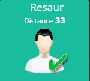

Description 
===========

Ce plugin permet de récupérer les devices d'un compte icloud et de récupérer la localisation , emettre un son et un message d'alerte.

> **IMPORTANT**
>
> Attention le plugin ne semble pas compatible avec le plugin Geoloc Ios

Configuration
=============

Dans la configuration du plugin ,il faut l'activer puis  aller dans plugins/Communication/Ios Icloud et vous allez pouvoir configurer vos comptes.

Les comptes
===========

Pour commencer cliquer sur "ajouter un compte"

Remplissez les champs et activer le cron. Sauvegarder et vos devices devraient apparaître.

Les commandes des comptes
=========================

**Active**: Active le rafraichissement des infos

**Inactive**: Inactive le rafraichissement des infos

**State** : Renvoit l'état du compte

**Refresh**: Lance le rafraichissement des infos

**cron1** : Fréquence de rafraichissement toutes les minutes

**cron5** : Fréquence de rafraichissement toutes les 5 minutes

**cron15** : Fréquence de rafraichissement toutes les 15 minutes

**cron30** : Fréquence de rafraichissement toutes les 30 minutes (0,30)

**cron60** : Fréquence de rafraichissement toutes les heures

**cronMiDay** : Fréquence de rafraichissement toutes les 12 heures (minuit,midi)

**cronDay** : Fréquence de rafraichissement toutes les jours (5h)

**getcron** : renvoit le cron actuel

Les devices
===========

Différentes infos sont récupérées.

> **IMPORTANT**
>
> Possible de paramétrer la précision de la localisation. Sur la capture si dessus , 70 correspond à une bonne précision. Pour être encore plus précis vous pouvez descendre jusqu'à 30. Laisser vide si vous ne voyez pas l'utilité
> La récupération des informations se fait selon le cron choisi.Si le paramètre récupéré est supérieur à la valeur souhaitée , la localisation ne sera pas mise à jour avant le prochain cron . Trés efficace pour l'utilisation dans la gestion d'une présence à domicile par exemple. Moins pour la localisation dans un périmètre. 

> **NOTE**
>
> Si vous voulez mettre à jour une commande d'un autre plugin (Geolocalisation, Geotrav). Sélectionner une commande. Sinon ne pas remplir ce champs

Les commandes des devices
=========================

**localisation**: La localisation du device

**Message**: Permet d'envoyer un message

**Play sound**: Lance une alerte sur le device

**Battery** : Informe du niveau de la batterie du device

**State** : Renvoit l'état du device. Si pas d'informations récupérées 0 sinon 1

**Timestamp** : Retourne le timestamp de la dernière synchronisation

Les équipements à position fixe
===============================

Dans le champs "coordonnées" , mettre la latitude et la longitude séparée d'une virgule

Les gestion des distances
=========================

Cliquer sur le plus de Distance

**Reference de la distance** : L'équipement de référence

**Distance** : En mètres

**Equipement à rechercher** : L'équipement que vous souhaitez surveiller (1 seul à choisir)

> **IMPORTANT**
>
> La distance se met à jour selon la fréquence de rafraichissement du compte du device rechercher.
>
> Une fois sauvegardée cela va créer des commandes utilisables dans les scénarios.

Les Widgets
===

Les devices
---

> **Important**
>
> Vous pouvez changer l'ordre des commandes dans la configuration de l'équipement et assigner un widget à chaque commande (Hormis la localisation).
>
> Pour la commande localisation , c'est le plugin qui crée le widget

- **Il faut aller dans la configuration avancée de chaque commande (Hormis localisation) pour associer un widget à chaque commande**
- **Dans l'exemple ci-dessus le widget " CircleBattery" a été assigné à la commande batterie et le widget "Presence_homme_2" a été assigné à la commande état.**

> **Note**
>
> si vous n'avez pas les widgets il faut les télécharger sur le market via le plugin widget

Les distances
---

- **Il faut aller dans la configuration avancée de chaque commande (Hormis localisation) pour associer un widget à chaque commande**

Le Panel desktop
---

- **Une fois activé , tous les devices apparaîtront dans le panel (Utile avec le pluging clink par exemple)**

