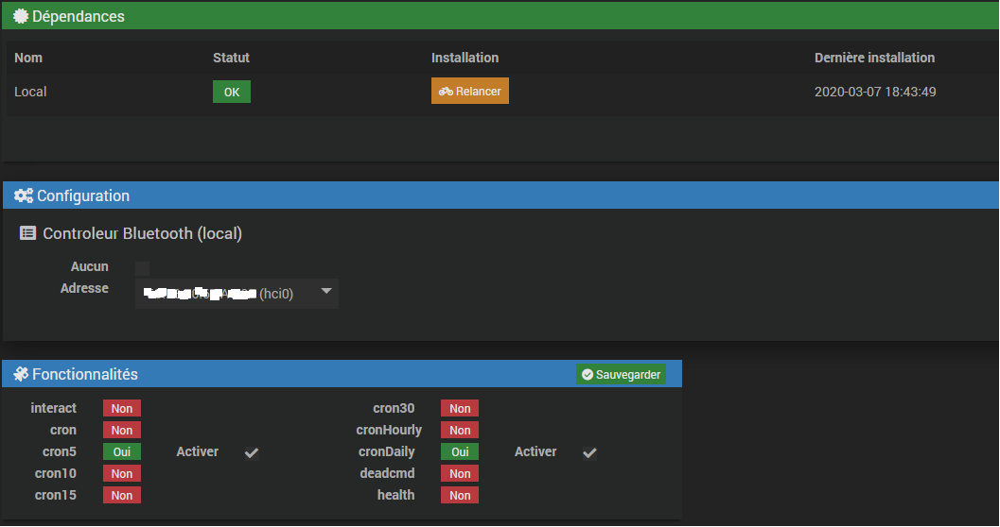

> **PRE REQUIS - INFORMATIONS**
>
> La portée des sondes est limitée et le plugin peut ne pas récupérer les informations (l’utilisation d’antenne est peut-être nécessaire)
>
> La cohabitation avec le plugin BLEA est assurée. Seul le scan  pose soucis. Il faut absolument arrêter le démon BLEA le temps du scan.
>
> Le retour d’état est spécifique à jeedom via les commandes on-off. (Ne fonctionne pas si utlisation via l'app officielle)

Description 
===

* Plugin permettant de piloter les équipements switch-bot (Actionneurs , sondes).

* Utilisation d'une clé bluetooth obligatoire. 

* Ne nécessite pas le hub pour fonctionner.

Installation
===

* Comme tous les plugins. Télécharger le Plugin switchbot sur le market.

* Activer le Plugin puis remplir les champs de configuration

Configuration générale
===

* Lancer l’installation des dépendances

* Si vous n’utilisez pas le plugin localement (Antennes) , cocher la case Aucun

* Ensuite il faut vous rendre dans l’onglet Plugins/Objets connectés/switchbot

* Maintenant vous avez la possibilité d’ajouter des équipements, des antennes avant de lancer la synchronisation ou de la lancer directement si tout se passe en local.

Les antennes
===

* Ajouter une antenne et activer la

* Onglet « Commandes »

* Configurer les informations selon vos paramètres de connexion

> **IMPORTANT**
>
>  Le device doit avoir absolument la syntaxe hci..  Sinon le plugin ne renverra pas les informations
>

* Sauvegarder , lancer l’installation des dépendances et lancer ensuite la génération des fichiers. (Impératifs)

> **NOTE**
>
>  Après chaque mise à jour il vous faudra peut-être relancer ces actions (Il faudra se référer au changelog)
>

* Une fois les antennes configurées  vous pouvez lancer le scan

Le scan
===

* Cliquer sur le bouton Synchronisation . Si tout se passe bien les équipements apparaitront

- *Wohand* : Actionneurs
- *WoSensor* : Sondes
- *WoCurtain* : Curtain (rideaux)

> **IMPORTANT**
>
>  Selon le nombre d’antennes le temps du scan peut être allongé. (compter 15 secondes par antenne)
>
> Pour les curtains, possibilité qu'ils n'apparaissent pas tous lors du scan s'ils sont appairés.Ajouter le alors manuellement .

Les équipements
===

Configuration
---

* *Adresse mac* : l’adresse mac de l’équipement .

* *Type* : cf information ci-dessus

* *Antenne* : l’antenne choisie pour le lancement des actions/récupération des informations

> **IMPORTANT**
>
>  Selon le nombre d’antenne l’éxécution de la commande peut prendre plus de temps. Mais la commande ne sera pas répétée.
>

*Les commandes*
---

### *Les actionneurs*
 

* Nom des commandes très explicite. La commande état réagit au commande on-off ( Pas de retour d’état si lancement de la commande via l’app officielle)

### *Les sondes*

*Refresh* : Récupération des données ( Toutes les 5 minutes)
 
Les crons
===

-	*SONDES* : Informations toutes les 5 minutes
-	*INFOS* : Batterie , firmware (1 fois par jour)

 

