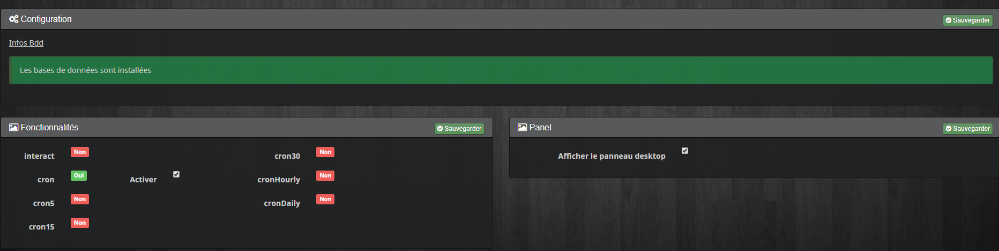
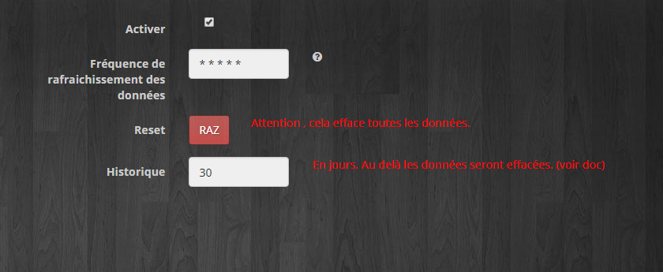
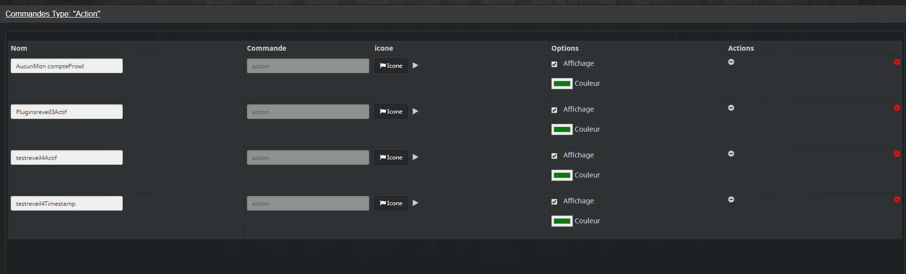
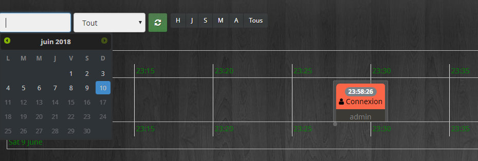
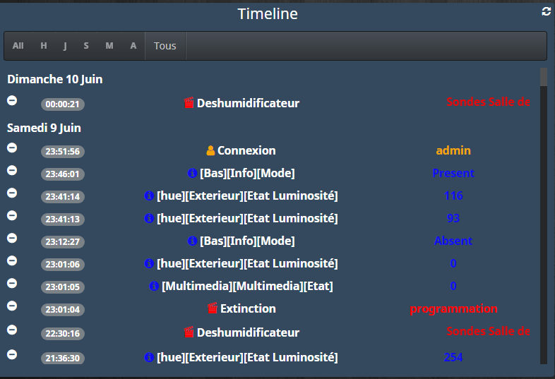

:::danger[UPDATE — 10.06.2018]
Timeline se met à jour.

**Pour les versions antérieures au 10.06.2018 :**
Il faut faire l’update → **supprimer l’équipement** et **en recréer un nouveau**.
:::

## Présentation

Ce plugin permet d’utiliser les données de la **timeline officielle** pour avoir un **widget** et une **timeline alternative**.

:::info[INFO]
Pour rappel : ce plugin est “né” avant la timeline officielle.
Maintenant il l’utilise ! Faut savoir évoluer, n’est-ce pas ?
:::

## Configuration

:::danger[IMPORTANT]
Toutes les modifications effectuées via le plugin **n’auront aucun impact** sur la timeline officielle.
:::

1. Télécharger le plugin sur le Market et l’activer.
2. Aller dans la configuration du plugin :

- **Info BDD** : doit être **au vert**, sinon un bouton permet de corriger.
- Possibilité d’activer le **panel desktop**.

Ensuite :

- **Plugins → Monitoring → Timeline**
- Créer l’équipement en cliquant sur le **+** pour le configurer :

### Paramètres de l’équipement

1. **Activer la timeline**
2. **Fréquence de rafraîchissement du cron** : fréquence à laquelle les données sont récupérées.
   Au début, laisser ainsi le temps que le plugin récupère les informations.
3. **Reset** : efface toutes les données du plugin (**pas** celles de la timeline officielle).
4. **Historique** : permet de définir l’historique de la sauvegarde.

:::note[Note]
Par défaut, le plugin récupère les infos de la timeline sur **1 semaine**.
:::

## Customisation

- Pour chaque commande, tu peux définir : **l’icône**, **la couleur**, et l’affichage sur le widget.
- Dans la colonne **Action** :
  - clic sur l’icône **remove blanche** : efface toutes les données de la commande dans le plugin (**pas** la timeline officielle)
  - clic sur l’icône **remove rouge** : efface la commande **et** les données du plugin (**pas** la timeline officielle)

:::danger[IMPORTANT]
Tu peux effacer la commande, mais si elle est encore active dans la timeline, elle sera **recréée automatiquement** lorsqu’elle sera de nouveau exécutée.
:::

## Le panel

Si tu actives le **panel desktop** dans la configuration générale du plugin, tu peux aller sur **Accueil → Timeline**.

1. Le premier champ permet de choisir les données d’un **jour précis**.
2. Le second permet de choisir le **type d’info** (infos, actions, messages…) et la timeline se met à jour.
3. La liste de boutons permet de sélectionner : **heure / jour / semaine précédente…**
4. Le **reset** est à utiliser en connaissance de cause : il efface toutes les données du plugin.

:::danger[IMPORTANT]
Un clic sur un élément de la timeline permet de le **supprimer** (timeline et widget).
:::

## Le widget

:::info[Note]
La raison d’être du plugin.
:::

1. Les **couleurs** et **icônes** définies dans la configuration de l’équipement servent pour le widget (et se retrouvent aussi dans la timeline).
2. Possibilité de sélectionner le type d’infos pour une meilleure visibilité.
3. Un clic sur l’icône **remove** efface définitivement la donnée du plugin (timeline et widget).
